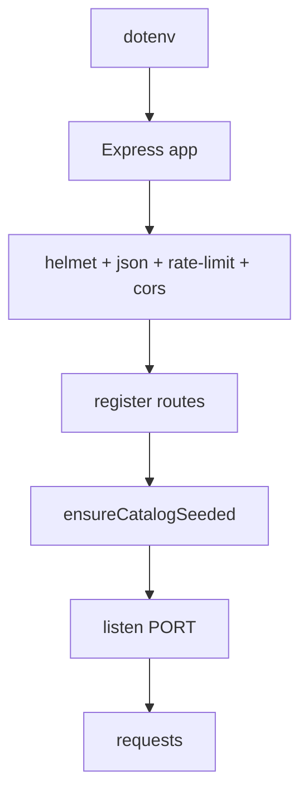
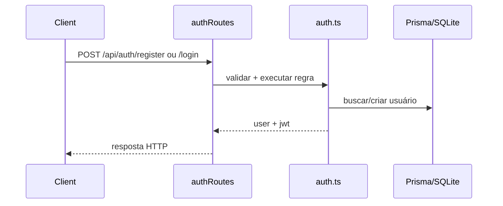
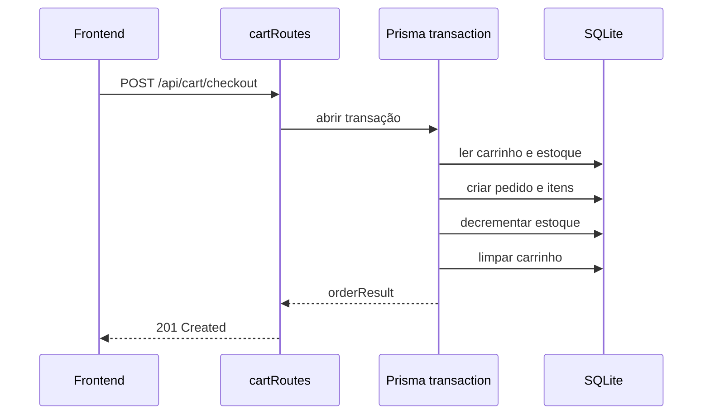

# Backend VeloTech

## Visão geral

O backend do VeloTech é um serviço Node.js com Express e TypeScript, responsável por autenticação, catálogo, carrinho, pedidos, chatbot, captação de mensagens de contato, newsletter e eventos de atividade. Ele usa Prisma como camada de acesso a dados e SQLite como banco persistente atual.

O backend foi construído com uma proposta clara: ser pequeno, direto e suficientemente completo para sustentar a loja, sem introduzir uma arquitetura excessivamente distribuída.

## Papéis do backend no sistema

O backend cumpre estas funções centrais:

1. expor endpoints HTTP consumidos pelo frontend;
2. validar entrada com `zod`;
3. proteger rotas autenticadas com JWT;
4. persistir entidades comerciais no banco via Prisma;
5. inicializar o catálogo automaticamente no bootstrap;
6. centralizar regras críticas de checkout e estoque.

## Arquivos obrigatórios do backend

### Infraestrutura do serviço

- `server/package.json`: scripts, dependências e ciclo de vida do backend.
- `server/tsconfig.json`: compilação TypeScript do serviço.
- `server/src/server.ts`: bootstrap do Express, middlewares, rotas, health check e shutdown.
- `server/src/prisma.ts`: instanciação compartilhada do `PrismaClient`.

### Middlewares e segurança

- `server/src/middleware/auth.ts`: valida JWT e injeta identidade do usuário na requisição.
- `server/src/middleware/asyncHandler.ts`: evita repetição de `try/catch` em handlers assíncronos.

### Regras de negócio e composição de dados

- `server/src/services/catalogService.ts`: sincroniza o catálogo estático com o banco.
- `server/src/data/catalogSeed.ts`: fonte de dados de categorias e produtos para seed.

### Rotas que definem o comportamento da API

- `server/src/routes/auth.ts`: lógica de autenticação e emissão de JWT.
- `server/src/routes/authRoutes.ts`: endpoints de registro, login e perfil.
- `server/src/routes/productsRoutes.ts`: listagem, filtros, metadados e detalhe de produto.
- `server/src/routes/cartRoutes.ts`: carrinho autenticado e checkout.
- `server/src/routes/ordersRoutes.ts`: histórico de pedidos.
- `server/src/routes/chatbot.ts`: lógica do assistente virtual.
- `server/src/routes/chatbotRoutes.ts`: endpoint HTTP do chatbot.
- `server/src/routes/engagementRoutes.ts`: contato, newsletter, atividade e auditoria.

## Como o backend foi construído

## Bootstrap do servidor

O ponto de entrada é `server/src/server.ts`. Na inicialização, ele:

- carrega variáveis de ambiente com `dotenv`;
- cria a aplicação Express;
- configura `helmet`, `express.json`, `cors` e `rate limit`;
- registra todas as rotas sob `/api`;
- executa `ensureCatalogSeeded()` antes de aceitar requisições;
- abre a porta configurada;
- fecha conexão com o banco em `SIGINT` e `SIGTERM`.

Isso significa que o catálogo base é garantido no startup, não como etapa manual separada do fluxo principal.

## Middlewares e borda HTTP

### Segurança de borda

O backend aplica:

- `helmet` para endurecer headers HTTP;
- `express-rate-limit` com janela de 15 minutos e teto de 300 requisições;
- `cors` baseado em `CLIENT_URL`, com tratamento especial para loopback;
- `express.json()` para payloads JSON.

### Tratamento de erros

Os erros são tratados em duas camadas:

- por rota, quando o caso de negócio precisa responder com um status específico;
- por middleware global, que captura `ZodError`, `FinalizacaoCompraError` e falhas inesperadas.

Essa separação deixa as regras explícitas sem abrir mão de uma rede de segurança final.

## Módulos de domínio

### Autenticação

O backend usa `bcryptjs` para hash de senha e `jsonwebtoken` para assinar o token.

Fluxo:

1. `authRoutes.ts` recebe a requisição.
2. `auth.ts` valida a entrada com `zod`.
3. o usuário é consultado ou criado via Prisma.
4. senha é comparada ou armazenada com hash.
5. o JWT é emitido com `JWT_SECRET` e `JWT_EXPIRES_IN`.
6. `authMiddleware` protege rotas privadas.

### Catálogo

O catálogo não depende só do banco: ele nasce de um seed estático em `server/src/data/catalogSeed.ts` e é sincronizado por `catalogService.ts`.

Esse serviço:

- desativa categorias e produtos que saíram do seed;
- faz `upsert` de categorias, marcas e produtos;
- atualiza estoque;
- recria imagens e especificações do produto.

É uma escolha prática para um e-commerce de demonstração, porque preserva um catálogo consistente sem depender de um painel administrativo.

### Carrinho e checkout

O módulo de carrinho concentra uma parte importante do backend.

Ele faz:

- criação automática do carrinho do usuário;
- leitura do carrinho com dados enriquecidos do produto;
- adição e atualização de itens;
- remoção individual ou limpeza total;
- checkout transacional.

No checkout, o código:

- valida método de pagamento e endereço;
- verifica estoque item a item;
- calcula subtotal, frete, imposto e desconto promocional;
- cria pedido, itens, histórico de status e pagamento;
- baixa estoque;
- limpa o carrinho.

Esse é o centro de integridade comercial do sistema.

### Pedidos

`ordersRoutes.ts` expõe o histórico do usuário autenticado, retornando pedidos ordenados por data, com seus itens embutidos e payload adaptado para o formato esperado pelo frontend.

### Chatbot

O backend do chatbot é intencionalmente simples e útil:

- valida a mensagem recebida;
- cria ou reutiliza uma conversa;
- persiste mensagens do usuário e do assistente;
- usa um catálogo derivado do seed para localizar produtos relevantes;
- gera respostas contextuais baseadas em intenção e palavras-chave.

O resultado é um assistente leve, persistente e integrado ao catálogo, sem depender de um LLM externo para o fluxo básico.

### Engagement e auditoria

`engagementRoutes.ts` abriga funcionalidades transversais:

- formulário de contato;
- inscrição em newsletter;
- eventos de atividade anônimos ou por sessão;
- eventos de auditoria autenticados.

Isso mostra que o backend não foi desenhado apenas para compra, mas também para observabilidade funcional do produto.

## Processos principais do backend

### Processo de subida do serviço

1. carregar ambiente;
2. montar middlewares;
3. registrar rotas;
4. sincronizar catálogo;
5. iniciar servidor;
6. aguardar requisições.

### Processo de autenticação

### Processo de checkout

## Pastas e arquivos que pertencem diretamente ao backend

Superfície principal do backend atual:

- `server/src/`
- `server/prisma/`
- `server/package.json`
- `server/tsconfig.json`

## Características marcantes do backend

- backend monolítico leve, com fronteira HTTP clara;
- Prisma como camada única de acesso ao banco;
- validação sistemática com `zod`;
- autenticação JWT simples e direta;
- seed automático do catálogo no bootstrap;
- checkout protegido por transação;
- chatbot persistido e acoplado ao catálogo;
- rotas segmentadas por domínio de negócio.

## Limites e observações do desenho atual

- o catálogo é altamente dependente do seed e não de um painel administrativo;
- parte das respostas é adaptada manualmente para o frontend, em vez de um DTO centralizado;
- o chatbot usa heurísticas locais, não IA externa;
- o backend assume SQLite como estado atual real do projeto.

Esses pontos não são defeitos por si só; eles definem o perfil arquitetural da aplicação.