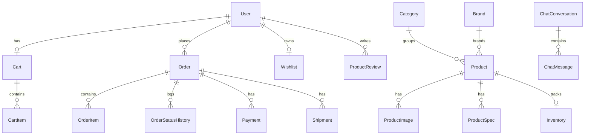

# Banco de Dados VeloTech

## Visão geral

O banco de dados atual do VeloTech é SQLite, acessado por Prisma. O schema está em `server/prisma/schema.prisma` e concentra toda a modelagem principal do e-commerce, incluindo usuários, catálogo, carrinho, pedidos, reviews, wishlist, chatbot, contato e eventos.

O desenho do banco mostra uma aplicação que foi além de um catálogo simples: ele já modela jornada comercial, atendimento, rastreio de atividade e histórico conversacional.

## Tecnologias envolvidas

- `SQLite` como banco persistente atual;
- `Prisma` como ORM e camada de modelagem;
- `@prisma/client` para acesso em tempo de execução;
- scripts de `generate`, `db push`, `migrate` e `studio` no backend.

## Arquivos obrigatórios da camada de dados

- `server/prisma/schema.prisma`: fonte oficial do modelo relacional.
- `server/src/prisma.ts`: ponto único de criação do `PrismaClient`.
- `server/src/services/catalogService.ts`: sincroniza o banco com o catálogo seed.
- `server/src/data/catalogSeed.ts`: dados mestres do catálogo inicial.

## Estrutura do schema

O schema pode ser lido em grandes blocos de domínio.

### 1. Identidade e usuário

Modelo principal: `User`

Campos importantes:

- identificação numérica autoincremental;
- e-mail único;
- nome e senha;
- telefone e endereço opcionais;
- papel (`UserRole`) e status (`UserStatus`);
- trilhas de verificação e último login;
- timestamps de criação e atualização.

Relacionamentos:

- `cart`;
- `orders`;
- `reviews`;
- `wishlist`;
- `activityEvents`;
- `auditEvents`.

Esse modelo coloca o usuário no centro da plataforma.

### 2. Catálogo

Entidades:

- `Category`
- `Brand`
- `Product`
- `ProductImage`
- `ProductSpec`
- `Inventory`

Características do desenho:

- produto ligado a categoria e marca;
- múltiplas imagens ordenadas;
- especificações técnicas ordenadas;
- estoque separado em tabela própria;
- flags de ativação, destaque e novidade;
- índices por categoria e marca para consulta.

Esse bloco representa bem um catálogo comercial real, inclusive com mídia e atributos técnicos.

### 3. Carrinho

Entidades:

- `Cart`
- `CartItem`

Características:

- um carrinho por usuário;
- item único por combinação `cartId + productId`;
- snapshot do preço unitário no momento em que o item entra no carrinho;
- rastreamento temporal de criação e atualização.

O snapshot de preço evita depender sempre do preço vivo do produto para reconstruir a intenção de compra.

### 4. Pedidos e pós-compra

Entidades:

- `Order`
- `OrderItem`
- `OrderStatusHistory`
- `Payment`
- `Shipment`

Esse é o bloco mais maduro do schema.

Ele cobre:

- número único do pedido;
- totais financeiros detalhados;
- método de pagamento;
- snapshot de endereço;
- itens com nome e imagem copiados para histórico;
- histórico de status;
- pagamentos;
- remessas e rastreio.

É um desenho correto para preservar histórico, mesmo que o produto original mude depois.

### 5. Conteúdo gerado pelo usuário e intenção de compra

Entidades:

- `ProductReview`
- `Wishlist`
- `WishlistItem`

O schema permite:

- review por produto e usuário;
- aprovação de review;
- lista de desejos por usuário;
- unicidade por item na wishlist.

### 6. Relacionamento e marketing

Entidades:

- `ContactMessage`
- `NewsletterSubscriber`
- `UserActivityEvent`
- `AuditEvent`

Essas tabelas ampliam o sistema para além da compra:

- contato comercial;
- relacionamento por newsletter;
- rastreamento de uso;
- trilha auditável de ações.

### 7. Conversa com assistente virtual

Entidades:

- `ChatConversation`
- `ChatMessage`

Características:

- conversa agrupada por `sessionId`;
- mensagens associadas a uma conversa;
- papel da mensagem (`user` ou `assistant`);
- índice por conversa e ordem temporal.

Isso permite manter histórico do assistente no backend, mesmo com uma implementação leve de resposta.

## Relacionamentos mais importantes

## Processos que envolvem o banco

### Processo de bootstrap do catálogo

1. o servidor sobe;
2. `ensureCatalogSeeded()` lê o seed estático;
3. categorias e produtos ausentes no seed são desativados;
4. categorias, marcas e produtos do seed recebem `upsert`;
5. imagens, specs e estoque são sincronizados.

Esse processo faz o banco nascer alinhado ao catálogo da aplicação.

### Processo de autenticação e usuário

1. registro grava um novo `User` com senha criptografada;
2. login lê o `User` por e-mail;
3. perfil autenticado consulta o mesmo registro por id.

### Processo de carrinho

1. o usuário autenticado recebe ou reutiliza um `Cart`;
2. os itens são guardados em `CartItem`;
3. cada item registra a quantidade e o preço unitário snapshot.

### Processo de checkout

1. a transação lê `Cart`, `CartItem`, `Product` e `Inventory`;
2. cria `Order`, `OrderItem`, `OrderStatusHistory` e `Payment`;
3. atualiza `Inventory`;
4. remove `CartItem`.

### Processo do chatbot

1. cria ou recupera `ChatConversation`;
2. grava mensagem do usuário em `ChatMessage`;
3. gera resposta;
4. grava mensagem do assistente.

## Características marcantes do banco atual

- modelo relativamente completo para um e-commerce desse porte;
- uso forte de snapshots para preservar histórico comercial;
- índices úteis em pontos críticos;
- separação clara entre catálogo, jornada de compra e engajamento;
- suporte nativo a chatbot persistido;
- simplicidade operacional por usar SQLite.

## Consequências práticas de usar SQLite aqui

### Vantagens

- setup muito simples;
- ótimo para desenvolvimento local, demonstração e projetos acadêmicos;
- zero necessidade de servidor de banco separado;
- boa integração com Prisma.

### Limites

- menor escalabilidade concorrente que um banco servidor como PostgreSQL;
- menos adequado para múltiplas instâncias escrevendo ao mesmo tempo;
- exige atenção extra em cenários de deploy distribuído.

Para o perfil atual do projeto, a escolha é coerente e reduz atrito de instalação.

## Leitura recomendada para entender a camada de dados

1. `server/prisma/schema.prisma`
2. `server/src/prisma.ts`
3. `server/src/services/catalogService.ts`
4. `server/src/routes/cartRoutes.ts`
5. `server/src/routes/ordersRoutes.ts`
6. `server/src/routes/chatbot.ts`

Essa sequência mostra primeiro o modelo, depois como ele é realmente manipulado em produção.