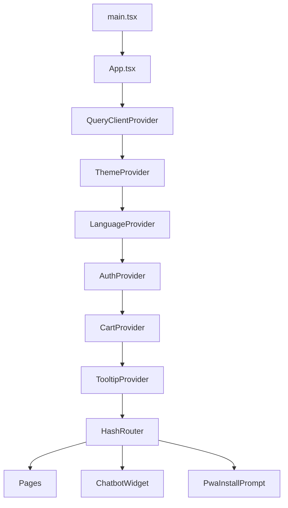
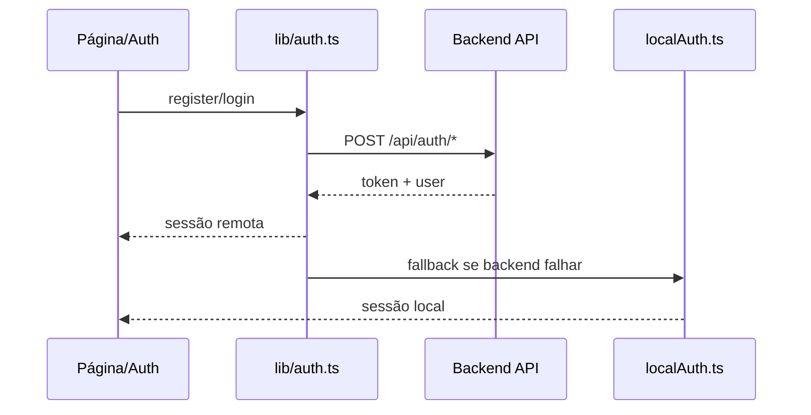

# Frontend VeloTech

## Visão geral

O frontend do VeloTech é uma aplicação React + TypeScript construída com Vite. Ele foi organizado como uma SPA, com roteamento no cliente, estado global via Context API, persistência híbrida entre `localStorage` e API HTTP, e um conjunto grande de componentes reutilizáveis baseados em Tailwind CSS e shadcn/ui.

Na prática, o frontend foi construído para atender quatro responsabilidades principais:

1. renderizar a experiência de navegação da loja;
2. coordenar estado global de autenticação, carrinho, idioma e tema;
3. consumir a API quando o backend está disponível;
4. manter parte da experiência operando localmente quando o backend não responde.

## Stack e decisões de construção

- `Vite` faz o empacotamento, o servidor de desenvolvimento e a resolução de aliases.
- `React 18` organiza a interface em componentes e páginas.
- `TypeScript` protege a modelagem de dados e o contrato entre páginas, hooks e utilitários.
- `react-router-dom` implementa o roteamento com `HashRouter`, o que facilita publicação estática.
- `@tanstack/react-query` está preparado no topo da árvore para consultas assíncronas e cache.
- `Tailwind CSS` e `shadcn/ui` sustentam a camada visual e os componentes compartilhados.
- `localStorage` é usado como persistência complementar para sessão local, carrinho, tema, idioma e pedidos locais.
- `service worker` e manifesto web adicionam comportamento de PWA.

## Arquivos obrigatórios do frontend

Os arquivos abaixo formam o núcleo mínimo do frontend atual. Sem eles, a aplicação deixa de inicializar, perde navegação ou quebra fluxos centrais.

### Infraestrutura e build

- `index.html`: ponto de montagem do app no elemento `root`.
- `package.json`: scripts de build, dev, preview, lint e typecheck do frontend.
- `vite.config.ts`: define `base`, alias `@` e a porta do dev server.
- `tsconfig.json`, `tsconfig.app.json`, `tsconfig.node.json`: sustentam compilação e tipagem.
- `tailwind.config.ts`, `postcss.config.js`, `eslint.config.js`: infraestrutura de estilo e qualidade.

### Bootstrap da aplicação

- `src/main.tsx`: cria a raiz React, injeta estilos globais e registra o service worker.
- `src/App.tsx`: compõe providers globais, registra rotas e injeta widgets transversais.
- `src/index.css` e `src/App.css`: base visual global da aplicação.
- `src/registerServiceWorker.ts`: ativa o service worker em produção.

### Estrutura funcional principal

- `src/pages/`: páginas navegáveis da loja.
- `src/components/`: componentes visuais, layout, chatbot, home, produto e UI base.
- `src/context/`: estado global de autenticação, carrinho, idioma e tema.
- `src/hooks/`: hooks com lógica de sessão, persistência e pedidos.
- `src/lib/`: funções de integração com API, autenticação local, pedidos locais, chatbot local e utilitários.
- `src/types/product.ts`: contrato tipado de produto e itens de carrinho.
- `src/data/`: dados estáticos usados pelo catálogo local, conteúdo e suporte ao fallback.
- `src/locales/pt-br.json`: dicionário de idioma usado pelo provider de linguagem.

### Recursos públicos e experiência instalada

- `public/manifest.webmanifest`: metadados para instalação como app.
- `public/sw.js`: service worker servido como arquivo público.
- `public/assets/`, `public/bikes/`, `public/logos/`, `public/roupas/`, `public/video_hero/`: mídia usada na loja.

## Como o frontend foi montado

### 1. Bootstrap e árvore raiz

O fluxo começa em `src/main.tsx`. Esse arquivo:

- monta o React no DOM;
- importa o CSS global;
- registra o service worker quando a aplicação está em produção.

Em seguida, `src/App.tsx` organiza a árvore principal da SPA. A composição atual é:

Essa ordem importa porque o carrinho depende da autenticação, e a UI inteira depende dos providers já montados.

### 2. Navegação e páginas

O roteamento é centralizado em `src/App.tsx`, com páginas em `src/pages/`. A navegação cobre:

- home;
- catálogo de produtos;
- detalhe de produto;
- carrinho;
- autenticação;
- wishlist;
- histórico de pedidos;
- páginas institucionais e de conteúdo;
- fallback `NotFound`.

O uso de `HashRouter` é coerente com hospedagem estática, porque reduz dependência de reescrita de rotas no servidor web.

### 3. Layout e componentes reutilizáveis

O frontend separa interface em blocos especializados:

- `src/components/layout/`: cabeçalho, rodapé e estrutura recorrente;
- `src/components/home/`: seções da home como hero, marcas, promoções e depoimentos;
- `src/components/product/`: cards e blocos de produto;
- `src/components/chatbot/`: widget de conversa;
- `src/components/pwa/`: prompt de instalação;
- `src/components/ui/`: biblioteca base reutilizável de interface.

Essa separação reduz repetição nas páginas e mantém a lógica de apresentação perto do domínio visual correto.

## Estado global do frontend

### Autenticação

`src/context/AuthContext.tsx` expõe o estado vindo de `src/hooks/useAuth.ts`.

O hook cuida de:

- recuperar token salvo;
- carregar perfil do usuário;
- registrar usuário;
- fazer login;
- limpar sessão no logout.

O detalhe mais importante da construção é o fallback híbrido:

- primeiro, o frontend tenta consumir a API em `src/lib/auth.ts`;
- se o backend estiver indisponível, pode cair para `src/lib/localAuth.ts`;
- nesse modo local, o usuário é persistido no navegador e recebe um token com prefixo local;
- o perfil é reconstruído localmente sem chamar a API.

Isso torna a aplicação resiliente para demonstração, ambientes estáticos e cenários sem backend ativo.

### Carrinho

`src/context/CartContext.tsx` delega a lógica para `src/hooks/useCartPersistence.ts`.

Esse hook faz uma escolha de persistência em tempo de execução:

- usuário autenticado com token real: usa a API remota;
- convidado ou sessão local: usa `localStorage`.

Processos cobertos pelo hook:

- carregar itens ao abrir a aplicação;
- adicionar item;
- remover item;
- atualizar quantidade;
- limpar carrinho;
- finalizar compra.

Quando a compra é local, ele usa `src/lib/localOrders.ts` para registrar o pedido no navegador. Quando é remota, chama a rota de checkout do backend.

### Idioma e tema

O sistema de idioma e tema é propositalmente enxuto:

- `src/context/LanguageContext.tsx` fixa o idioma em `pt-br`, aplica `lang="pt-BR"` e usa `src/locales/pt-br.json`;
- `src/context/ThemeContext.tsx` fixa a aplicação em tema `dark` e grava essa preferência no navegador.

Hoje, ambos os providers funcionam mais como normalizadores de experiência do que como seletores dinâmicos.

## Comunicação com o backend

### Resolução da URL da API

`src/lib/api.ts` calcula a URL base da API com estas regras:

- usa `VITE_API_URL` quando definido;
- em localhost, assume `http://localhost:3001/api`;
- em produção, usa `/api` relativo ao domínio atual.

Essa lógica simplifica deploy estático e ambiente local sem exigir mudança constante de código.

### Estratégia de integração

O frontend usa `fetch` diretamente nos módulos de domínio em vez de concentrar tudo em um único client HTTP.

Esse padrão aparece em:

- `src/lib/auth.ts` para autenticação;
- `src/hooks/useCartPersistence.ts` para carrinho e checkout;
- `src/components/chatbot/ChatbotWidget.tsx` para conversa com o assistente.

É uma arquitetura simples e legível, com o contrato da API próximo de quem realmente usa cada rota.

## Processos principais do frontend

### Processo de inicialização

1. O browser carrega `index.html`.
2. `src/main.tsx` monta o app.
3. `src/App.tsx` cria providers e rotas.
4. `useAuth` tenta restaurar a sessão.
5. `useCartPersistence` carrega carrinho remoto ou local.
6. O chatbot e o prompt PWA ficam disponíveis globalmente.

### Processo de autenticação

### Processo de carrinho e checkout

1. O usuário adiciona itens a partir de listagem ou detalhe.
2. `useCartPersistence` decide entre persistência remota ou local.
3. O estado é recalculado e distribuído via `CartContext`.
4. No checkout:
5. sessão remota chama a API de carrinho/pedido;
6. sessão local cria um pedido local e limpa o carrinho.

### Processo do chatbot

O widget em `src/components/chatbot/ChatbotWidget.tsx` tenta primeiro o backend. Se a API do assistente falhar, usa `src/lib/chatbotLocalRag.ts`.

Esse desenho produz dois modos:

- modo conectado, com histórico persistido em banco;
- modo local, com recomendação baseada no catálogo estático do frontend.

### Processo PWA

1. build em produção publica `sw.js`;
2. `registerServiceWorker()` registra o worker após o carregamento da página;
3. `manifest.webmanifest` descreve instalação e metadados do app;
4. `PwaInstallPrompt` expõe a camada de UX para instalação.

## Pastas que pertencem diretamente ao frontend

Estas pastas fazem parte do domínio do front e devem ser tratadas como superfície primária da interface:

- `src/`
- `public/`
- `index.html`
- `vite.config.ts`
- `tailwind.config.ts`
- `postcss.config.js`
- `components.json`
- `eslint.config.js`

## O que é estrutural e o que é complementar

### Estrutural

- bootstrap React;
- roteamento;
- providers globais;
- páginas;
- componentes compartilhados;
- integração com API;
- persistência local;
- PWA.

### Complementar, mas importante

- conteúdos estáticos em `src/data/`;
- traduções;
- catálogo local usado como fallback;
- estilos finos e tokens visuais.

## Características marcantes do frontend atual

- SPA orientada a catálogo e jornada de compra;
- tolerância a indisponibilidade do backend;
- autenticação híbrida remota/local;
- carrinho híbrido remoto/local;
- chatbot com fallback local;
- hospedagem amigável para ambiente estático graças a `HashRouter`;
- base pronta para PWA;
- organização por domínio funcional, não apenas por tipo técnico.

## Leitura recomendada no código

Para entender o frontend rapidamente, a melhor ordem é:

1. `src/main.tsx`
2. `src/App.tsx`
3. `src/hooks/useAuth.ts`
4. `src/hooks/useCartPersistence.ts`
5. `src/lib/auth.ts`
6. `src/components/chatbot/ChatbotWidget.tsx`
7. `src/pages/`

Essa sequência mostra primeiro o bootstrap, depois o estado global e por fim os fluxos de negócio visíveis ao usuário.